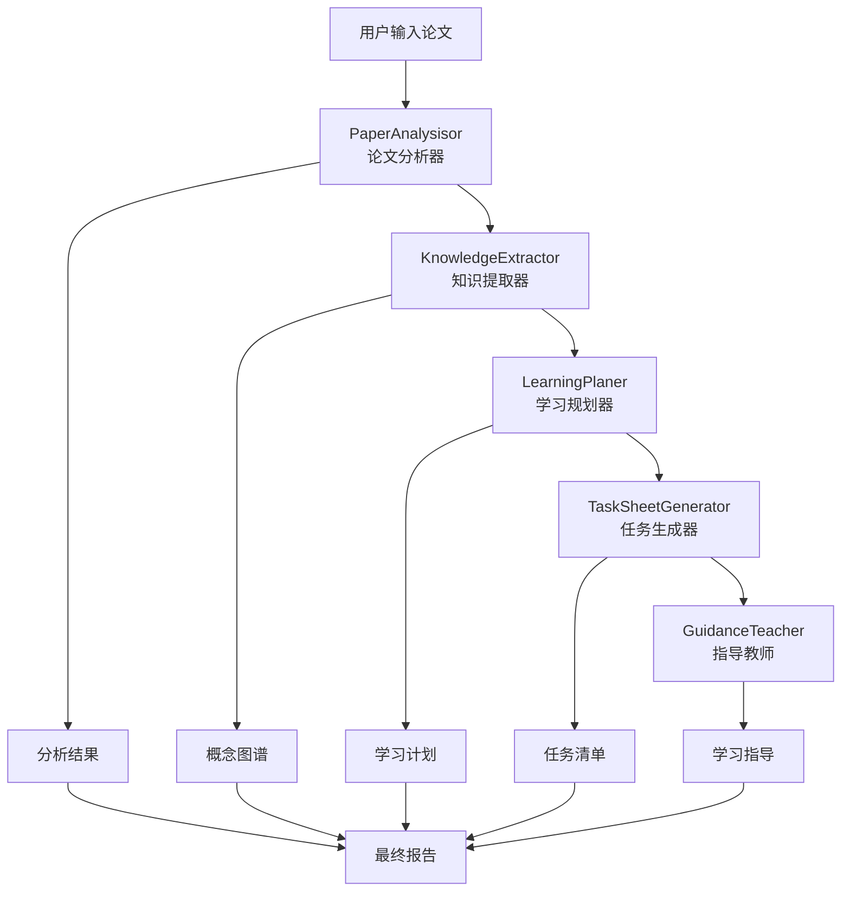

# 🧠 LearnPilot: AI 驱动的研究论文学习助手

> 纸上得来终觉浅，绝知此事要躬行。

**LearnPilot** 是一个开源的智能学习助手，专门设计用于帮助您深度、高效、交互式地学习研究论文。无论您是学生、研究者还是自学者，LearnPilot 都能指导您从"找到要学什么"到"通过任务、反馈和探索来掌握它"。

## 🎯 项目愿景

LearnPilot 不是为传统教科书学习而设计的通用导师。相反，它诞生于一个非常专注的需求：

**帮助学习者——特别是研究人员、工程师和自学者——深度参与围绕特定主题或学术子领域的小型、精心策划的论文集合。**

在现实世界的学习中，我们通常不面对整个课程体系——我们面对的是定义一个方法、一个趋势或一个研究方向的 3 到 10 篇关键论文。LearnPilot 正是为这种情况而构建的：帮助您导航、理解和应用论文集群的核心思想。

这使得 LearnPilot 非常适合：
- 快速进入新的研究领域（例如"扩散模型"或"RLHF"）
- 理解读书会或课程大纲中的论文集合
- 构建任务驱动、面向输出的学习路径而不会被淹没

## ✨ 核心功能

### 🔍 智能论文分析
- **自动解析**：支持 PDF 到 Markdown 的智能转换
- **深度分析**：使用 LLM 提取论文的研究问题、主要方法和核心贡献
- **难度评估**：自动评估论文难度级别和学习时间
- **前置知识**：识别理解论文所需的背景知识

### 🧠 概念提取与知识图谱
- **核心概念识别**：从论文中提取主要技术概念和方法
- **概念关系分析**：构建概念间的依赖和关联关系
- **知识领域映射**：识别论文所属的技术领域
- **跨论文分析**：分析多篇论文间的概念关系

### 📋 个性化学习规划
- **智能排序**：基于难度和依赖关系推荐论文阅读顺序
- **时间估算**：提供详细的学习时间预估
- **个性化配置**：支持不同学习水平和时间安排
- **学习建议**：生成具体可操作的学习指导

### 📊 可视化与报告
- **学习报告**：生成详细的学习分析报告
- **进度跟踪**：记录学习进度和完成情况
- **概念图谱**：可视化知识结构和概念关系

## 🏗️ 项目架构

```
src/learn_pilot/
├── agents/                           # AI Agent 模块
│   ├── paper_analysisor.py          # 论文分析 Agent
│   ├── knowledge_extractor.py       # 概念提取 Agent
│   ├── learning_planer.py           # 学习计划 Agent（开发中）
│   ├── task_sheet_generator.py      # 任务生成 Agent（开发中）
│   ├── guidance_teacher.py          # 学习指导 Agent（开发中）
│   └── tools/                       # Agent 工具集
├── core/                            # 核心配置与基础功能
│   ├── config/                      # 配置管理
│   ├── agents/                      # Agent 基础框架
│   └── logging/                     # 日志系统
├── services/                        # 业务服务层
│   ├── pipeline_orchestrator.py    # 流水线编排器
│   ├── arxiv_monitor/              # arXiv 监控服务
│   └── vector_search/              # 向量搜索服务
├── literature_utils/               # 文献处理工具
│   ├── knowledge_parser/           # PDF/Markdown 解析
│   ├── knowledge_search/           # 知识搜索
│   └── markdown_parser.py          # Markdown 论文解析
├── tools/                          # 通用工具集
│   ├── file_system/               # 文件系统工具
│   ├── database/                  # 数据库工具
│   ├── translation/               # 翻译工具
│   ├── pricing/                   # 成本计算工具
│   └── graph_utils.py             # 图形工具
├── models/                         # 数据模型定义
│   ├── paper_models.py            # 论文数据模型
│   ├── task_models.py             # 任务数据模型
│   └── graph_models.py            # 图形数据模型
└── main.py                        # 主入口文件
```

## 🔄 核心工作流程

LearnPilot 的核心功能基于以下 AI Agent 工作流：



**主要输出文件格式：**
- `user_data/outputs/analysis/` - 论文分析结果
- `user_data/outputs/extraction/` - 概念提取结果
- `user_data/outputs/pipeline_report.md` - 整体学习报告
- `user_data/outputs/knowledge_graph.json` - 知识图谱数据（开发中）
- `user_data/outputs/task_sheet.md` - 学习任务清单（开发中）

## 🚀 快速开始

### 环境要求

- Python 3.8+
- OpenAI API Key（支持 GPT-4）

### 安装步骤

1. **克隆项目**
```bash
git clone https://github.com/your-repo/LearnPilot.git
cd LearnPilot
```

2. **安装依赖**
```bash
pip install -r requirements.txt
```

3. **配置环境变量**
```bash
# 创建 .env 文件
cp .env.example .env

# 编辑 .env 文件，添加您的 OpenAI API Key
OPENAI_API_KEY=your_api_key_here
```

4. **准备论文文件**
```bash
# 将论文 PDF 文件放入 user_data/papers/ 目录
# 或直接使用 Markdown 格式的论文文件
```

### 基本使用

#### 1. 完整流水线分析

```bash
# 分析 user_data/papers/ 目录中的所有论文
python -m src.learn_pilot.main

# 指定输入和输出目录
python -m src.learn_pilot.main \
    --input_dir=./user_data/papers \
    --output_dir=./user_data/outputs
```

#### 2. 个性化配置

```bash
# 设置学习水平和时间安排
python -m src.learn_pilot.main \
    --user_level=beginner \
    --daily_hours=2 \
    --total_days=14 \
    --learning_goals="深入理解Transformer架构和注意力机制"
```

#### 3. 单步骤执行

```bash
# 只运行论文分析
python -m src.learn_pilot.main --step=analysis

# 只运行概念提取
python -m src.learn_pilot.main --step=extraction
```

#### 4. PDF 转换测试

```bash
# 快速测试 PDF 到 Markdown 转换
./quick_test.sh

# 手动转换 PDF
python -m src.learn_pilot.literature_utils.knowledge_parser.pdf_to_markdown \
    --pdf-path paper.pdf \
    --output paper.md
```

## 📚 详细使用指南

### 支持的输入格式

#### Markdown 格式论文
LearnPilot 原生支持结构化的 Markdown 论文文件：

```markdown
# 论文标题

**作者**: 作者姓名

## Abstract
论文摘要内容...

## Introduction
介绍部分内容...

## Method
方法描述...
```

#### PDF 论文
使用内置的 PDF 转换工具：

```bash
python -m src.learn_pilot.literature_utils.knowledge_parser.pdf_to_markdown \
    --pdf-path input.pdf \
    --output output.md \
    --max-pages 10
```

### 命令行参数详解

```bash
python -m src.learn_pilot.main [选项]

必选参数：
  --input_dir PATH          输入论文目录 (默认: ./user_data/papers)
  --output_dir PATH         输出结果目录 (默认: ./user_data/outputs)

流水线控制：
  --step {analysis,extraction,full}  执行特定步骤 (默认: full)

个性化设置：
  --user_level {beginner,intermediate,advanced}  用户水平 (默认: intermediate)
  --daily_hours FLOAT       每日学习时间(小时) (默认: 2.0)
  --total_days INT          总学习天数 (默认: 7)
  --learning_goals TEXT     学习目标描述

高级选项：
  --config_file PATH        配置文件路径 (JSON格式)
  --verbose                 详细输出模式
  --dry_run                 试运行模式（不执行实际操作）
```

### 配置文件示例

创建 `config.json` 文件进行高级配置：

```json
{
  "model_settings": {
    "temperature": 0.7,
    "max_tokens": 2000,
    "model_name": "gpt-4o-2024-11-20"
  },
  "processing_settings": {
    "chunk_size": 1000,
    "overlap": 200,
    "language": "zh-cn"
  },
  "output_settings": {
    "format": "markdown",
    "include_code": true,
    "include_graphs": true
  }
}
```

## 📊 输出说明

### 学习报告结构

运行完成后，您将在输出目录中找到：

```
user_data/outputs/
├── analysis/
│   ├── paper_1_analysis.json      # 单篇论文分析结果
│   ├── paper_2_analysis.json
│   └── overall_analysis.json      # 整体分析结果
├── extraction/
│   ├── paper_1_concepts.json      # 单篇论文概念提取
│   ├── paper_2_concepts.json
│   └── cross_paper_analysis.json  # 跨论文概念分析
└── pipeline_report.md             # 完整学习报告
```

### 学习报告内容

生成的 `pipeline_report.md` 包含：

1. **学习配置** - 您的个人设置和目标
2. **论文概览** - 论文数量、难度分布、时间估算
3. **核心概念** - 高频概念和知识领域分布
4. **学习建议** - 基于分析的具体建议
5. **推荐学习路径** - 按依赖关系排序的阅读顺序

## 🛠️ 技术栈

- **AI框架**: OpenAI GPT-4, Structured Output Agents
- **文档处理**: Marker PDF, Markdown Parser
- **数据处理**: NumPy, NetworkX, FAISS
- **Web框架**: Streamlit (计划中)
- **异步处理**: AsyncIO, aiohttp, aiofiles
- **日志系统**: Loguru
- **配置管理**: python-dotenv

## 🔧 开发指南

### 本地开发

1. **创建开发环境**
```bash
python -m venv venv
source venv/bin/activate  # Linux/Mac
# 或 venv\Scripts\activate  # Windows
```

2. **安装开发依赖**
```bash
pip install -r requirements.txt
pip install -e .
```

3. **运行测试**
```bash
# 单元测试
./unit_test.sh

# 快速功能测试
./quick_test.sh

# 完整测试
python -m pytest tests/
```

### 扩展 Agent

LearnPilot 采用模块化的 Agent 架构，您可以轻松添加新的功能：

```python
from src.learn_pilot.core.agents.structured_output_agent import StructuredOutputAgent

class CustomAgent:
    def __init__(self, config):
        self.config = config
        
    async def process(self, input_data):
        # 实现您的逻辑
        pass
```

## 📈 路线图

### ✅ 已完成功能

- [x] 📚 PDF 到 Markdown 转换
- [x] 📊 智能论文分析 (PaperAnalysisor)
- [x] 🧠 概念提取与关系分析 (KnowledgeExtractor)  
- [x] 🔄 流水线编排系统 (PipelineOrchestrator)
- [x] 📝 学习报告生成
- [x] ⚙️ 个性化配置支持

### 🚧 开发中功能

- [ ] 📋 学习计划生成器 (LearningPlaner)
- [ ] 🧪 任务工作表生成器 (TaskSheetGenerator)
- [ ] 👨‍🏫 智能学习指导 (GuidanceTeacher)
- [ ] 🌐 知识图谱可视化
- [ ] 📱 Web UI 界面 (Streamlit)

### 🔮 未来计划

- [ ] 🔍 集成论文搜索 (arXiv, Semantic Scholar)
- [ ] 💬 智能问答系统
- [ ] 📊 学习进度跟踪
- [ ] 👥 团队学习模式
- [ ] 🔌 插件系统
- [ ] 📱 移动端支持

## 🤝 贡献指南

我们欢迎所有形式的贡献！

### 如何贡献

1. **Fork 项目**
2. **创建功能分支** (`git checkout -b feature/amazing-feature`)
3. **提交更改** (`git commit -m 'Add amazing feature'`)
4. **推送到分支** (`git push origin feature/amazing-feature`)
5. **创建 Pull Request**

### 贡献类型

- 🐛 Bug 修复
- ✨ 新功能开发
- 📚 文档改进
- 🎨 UI/UX 改进
- 🔧 性能优化
- 🧪 测试用例

## 📄 许可证

本项目采用 MIT 许可证 - 查看 [LICENSE](LICENSE) 文件了解详情。

## 🙏 致谢

- 感谢 OpenAI 提供强大的 GPT 模型
- 感谢 Marker 项目提供优秀的 PDF 解析能力
- 感谢所有贡献者和用户的支持

## 📞 联系我们

- 📧 Email: [bin.liangmathematicsstudent@gmail.com]
- 🐛 Issues: [GitHub Issues](https://github.com/BinLiang2021/LearnPilot/issues)
- 💬 Discussions: TODO

---


